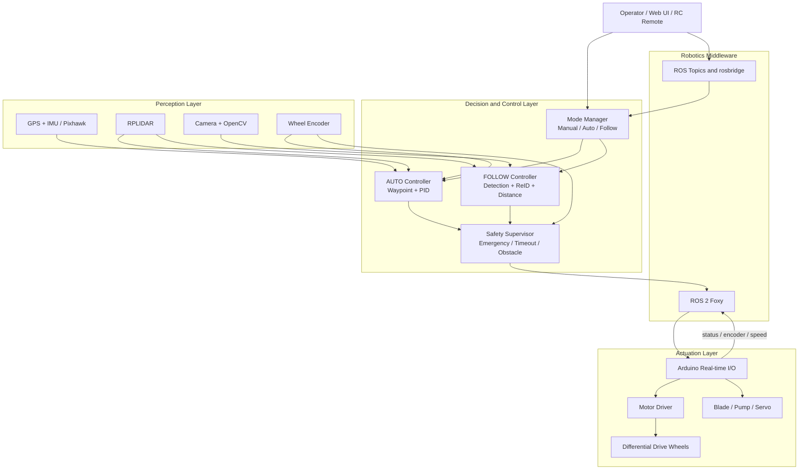
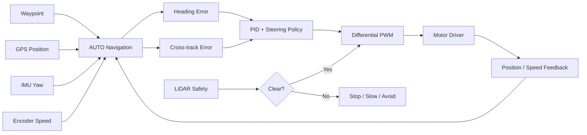
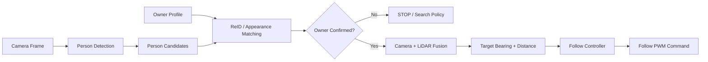
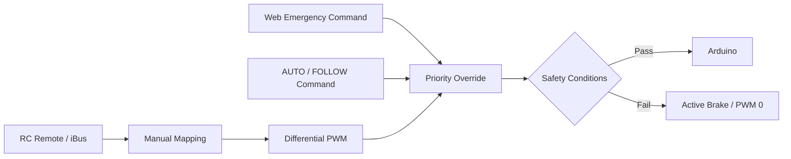
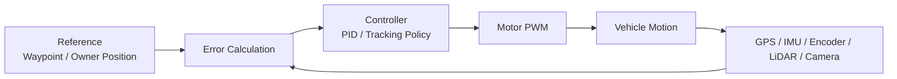
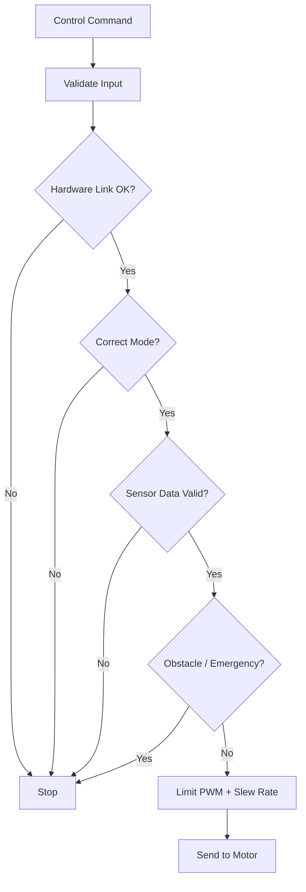

# Engineering Presentation: Autonomous Agricultural Vehicle

เอกสารนี้เป็นเนื้อหาสำหรับนำไปจัดทำสไลด์ โดยเน้นภาพรวมเชิงวิศวกรรมและจุดเด่นของระบบ
ไม่ใช่รายการรายละเอียดทุกบรรทัดใน source code

## Slide 1: System Vision

### Autonomous Agricultural Vehicle

ระบบรถเกษตรอัตโนมัติที่รองรับ 3 รูปแบบการควบคุม:

- **Manual:** มนุษย์ควบคุมโดยตรงผ่านรีโมท RC
- **AUTO:** รถนำทางตาม waypoint ด้วย GPS/IMU และควบคุมแบบ closed-loop
- **FOLLOW ME:** รถติดตาม owner ด้วย Computer Vision, ReID และ LiDAR

### Engineering statement

> ออกแบบเป็นระบบควบคุมหลายโหมดที่รวม Human-in-the-loop, autonomous navigation และ AI-based person following ไว้บน platform เดียวกัน โดยมี safety layer คั่นก่อนคำสั่งถูกส่งไปยังมอเตอร์

## Slide 2: System Architecture

## Slide 3: Engineering Stack

| Layer | Technology | Engineering role |
|---|---|---|
| User interface | Web UI, Flask, JavaScript, roslibjs | Command, map, waypoint และ monitoring |
| Middleware | ROS 2 Foxy, rosbridge | Message-based communication ระหว่าง node |
| Main controller | Python, `lawnmower_node` | Mode control, navigation, safety และ PWM coordination |
| Navigation | GPS, Pixhawk, IMU, waypoint logic | Localization และ heading control |
| Feedback control | PID, encoder, differential drive | ลด error และควบคุมล้อซ้าย/ขวา |
| Perception | OpenCV, YOLO, MediaPipe | ตรวจจับบุคคลจากภาพ |
| Identity | OSNet ReID, MobileNet, color features | แยก owner ออกจากบุคคลอื่น |
| Range safety | RPLIDAR, LaserScan | ตรวจ obstacle และประเมินระยะ target |
| Real-time I/O | Arduino, iBusBM, Serial, PWM | อ่าน RC และสร้างสัญญาณควบคุมมอเตอร์ |

## Slide 4: AUTO Navigation

### Input -> Computation -> Output

### สิ่งที่ระบบ AUTO แก้ปัญหา

- รถต้องรู้ว่าตัวเองอยู่ที่ใดจาก GPS
- รถต้องรู้ว่าหันไปทางใดจาก IMU
- รถต้องรักษาแนวเส้นทาง ไม่ใช่เพียงวิ่งเข้าหาจุดหมาย
- ความเร็วล้อซ้าย/ขวาต้องปรับต่างกันเพื่อสร้างการเลี้ยว
- LiDAR ต้องมีสิทธิ์หยุดคำสั่งขับเมื่อเส้นทางไม่ปลอดภัย

### คำอธิบายสำหรับพูดบนสไลด์

> AUTO ไม่ได้เป็นเพียงการส่งรถไปยังพิกัดปลายทาง แต่เป็น closed-loop navigation ที่คำนวณ heading error และ cross-track error แล้วปรับ differential PWM จาก feedback ของ GPS, IMU และ encoder โดยมี LiDAR เป็น safety gate ก่อนการขับเคลื่อน

## Slide 5: FOLLOW ME Perception

### Perception pipeline

### สิ่งที่ระบบ FOLLOW ME แก้ปัญหา

- ตรวจว่าภาพมีบุคคลหรือไม่
- แยก owner ที่เลือกออกจากบุคคลอื่น
- ใช้ตำแหน่งในภาพหา bearing ซ้าย/ขวา
- ใช้ขนาดเป้าหมายและ LiDAR ประเมินระยะ
- รักษาระยะติดตาม ไม่เข้าใกล้เกินไป
- หยุดเมื่อไม่มั่นใจหรือพบ obstacle

### คำอธิบายสำหรับพูดบนสไลด์

> FOLLOW ME แบ่งปัญหาเป็น 2 ขั้น คือ perception และ control: ขั้นแรกตรวจจับและยืนยัน identity ของ owner ขั้นที่สองรวมข้อมูลภาพกับ LiDAR เพื่อคำนวณ bearing และระยะ แล้วแปลงเป็นคำสั่ง differential drive

## Slide 6: Manual and Mode Management

### ประเด็นสำคัญ

- Manual เป็น direct human control
- AUTO และ FOLLOW เป็น supervisory control จาก Jetson/ROS 2
- Arduino ทำหน้าที่ real-time I/O และ motor actuation
- Emergency override มี priority สูงกว่าคำสั่งขับปกติ
- Mode switch มี debounce เพื่อป้องกันการเปลี่ยนโหมดจากสัญญาณรบกวน

## Slide 7: Closed-loop Control

### สรุปเชิงวิศวกรรม

ระบบใช้ closed-loop control เพราะคำสั่งมอเตอร์ไม่ได้ถูกส่งเพียงครั้งเดียวแล้วจบ แต่ระบบวัดผลลัพธ์จาก sensor แล้วนำกลับมาคำนวณคำสั่งใหม่อย่างต่อเนื่อง

- AUTO: feedback หลักคือ GPS, IMU และ encoder
- FOLLOW ME: feedback หลักคือ camera, ReID, LiDAR และ odometry
- Manual: reference มาจากมนุษย์ และ encoder/status ใช้ตรวจสอบผลลัพธ์

## Slide 8: Safety Engineering

### Safety mechanisms

- Input validation และ signal loss detection
- Mode debounce และ mode consistency check
- Emergency latch และ priority override
- Command timeout สำหรับ FOLLOW
- GPS readiness check สำหรับ AUTO
- LiDAR obstacle stop
- PWM limit และ slew-rate limiting
- Active brake เมื่อคำสั่งเป็นศูนย์

## Slide 9: Key Engineering Contributions

1. **Multi-mode control architecture**: Manual, AUTO และ FOLLOW ME ทำงานบน platform เดียวกัน
2. **Sensor-driven closed-loop control**: ใช้ feedback เพื่อแก้คำสั่งแบบต่อเนื่อง
3. **AI perception with identity verification**: ไม่ได้ตรวจแค่ “มีคน” แต่ตรวจว่าเป็น owner ที่เลือก
4. **Camera-LiDAR fusion**: ใช้จุดเด่นของกล้องและ LiDAR ร่วมกัน
5. **Real-time actuation separation**: แยก high-level decision บน ROS 2 ออกจาก real-time motor I/O บน Arduino
6. **Safety-first command path**: ทุกคำสั่งต้องผ่าน mode, link, sensor และ obstacle checks ก่อนถึงมอเตอร์

## Slide 10: One-slide Summary

> ระบบนี้เป็น autonomous vehicle platform แบบ multi-modal ที่รวม direct RC control, waypoint navigation และ AI-based person following เข้าด้วยกัน โดยใช้ ROS 2 เป็น communication backbone, Python เป็น high-level controller, Arduino เป็น real-time actuator และใช้ GPS/IMU, encoder, LiDAR และกล้องเป็น feedback เพื่อสร้างระบบควบคุมแบบ closed-loop ที่มี safety supervision

## คำแนะนำการนำเสนอ

- ใช้เอกสารนี้เป็นเนื้อหาสำหรับสไลด์ ไม่ต้องนำทุกหัวข้อไปใส่ทั้งหมด
- สำหรับการนำเสนอ 5-7 นาที ใช้ Slide 1, 2, 4, 5, 7 และ 9
- ให้แสดง Technology Stack เป็นตารางสั้น ๆ และอธิบายรายละเอียดด้วยคำพูด
- อย่าใส่ชื่อ environment variable หรือค่าพารามิเตอร์จำนวนมากบนสไลด์หลัก ให้ย้ายไป appendix
