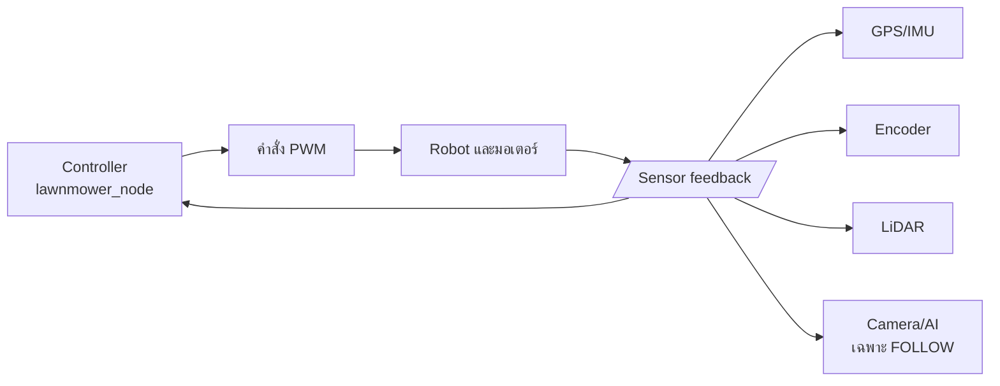
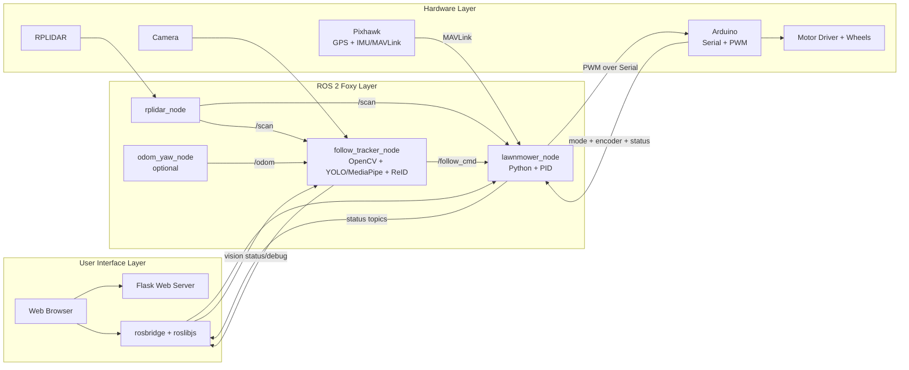
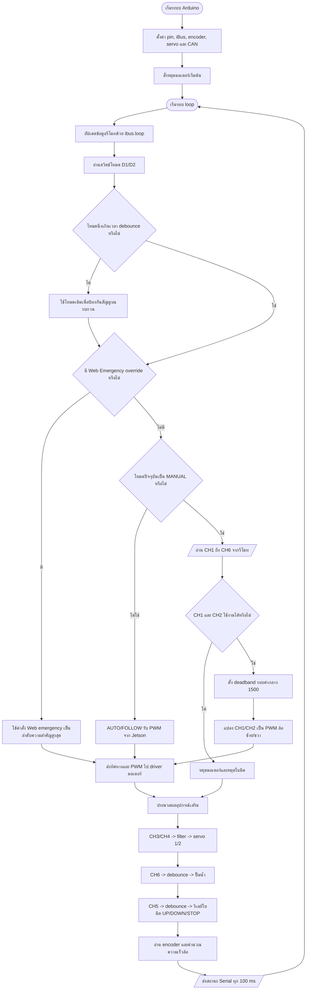

# Standard Flowchart: AUTO และ FOLLOW ME

## ประเภทของ Flowchart

ระบบนี้อธิบายได้ว่าเป็น:

1. **System Operational Flowchart**: แสดงลำดับการทำงานตั้งแต่ผู้ใช้สั่งงานจนถึงมอเตอร์
2. **Decision-Based Control Flowchart**: มีจุดตัดสินใจตรวจสอบความพร้อมและความปลอดภัย
3. **Closed-Loop Feedback Control**: รับ feedback จาก GPS, IMU, encoder, LiDAR และกล้อง แล้วปรับคำสั่งมอเตอร์ต่อเนื่อง

## สัญลักษณ์ที่ใช้

| รูปแบบ | ความหมายในแผนผัง |
|---|---|
| วงรี | จุดเริ่มต้นหรือสิ้นสุด |
| สี่เหลี่ยม | ขั้นตอนการประมวลผลหรือการควบคุม |
| สี่เหลี่ยมขนมเปียกปูน | จุดตรวจสอบเงื่อนไข/การตัดสินใจ |
| สี่เหลี่ยมด้านขนาน | ข้อมูลเข้า/ข้อมูลออก |
| ลูกศรวนกลับ | Feedback loop หรือการทำงานซ้ำ |

## 1. Flow หลักของระบบ


## 2. Flow มาตรฐานของ AUTO


**คำอธิบายสำหรับรายงาน:**

AUTO เป็น **waypoint-based autonomous navigation** โดยใช้ GPS/IMU สำหรับระบุตำแหน่งและทิศทาง,
ใช้ encoder ตรวจการเคลื่อนที่จริง และใช้ LiDAR เป็นชั้นความปลอดภัยก่อนส่ง PWM ไปยังมอเตอร์

## 3. Flow มาตรฐานของ FOLLOW ME


**คำอธิบายสำหรับรายงาน:**

FOLLOW ME เป็น **vision-based person following with LiDAR safety** โดยใช้กล้องและ AI
ตรวจจับ/ยืนยัน owner, ใช้ LiDAR ประเมินระยะและตรวจสิ่งกีดขวาง แล้วปรับ PWM แบบต่อเนื่อง
เพื่อรักษาทิศทางและระยะห่างจาก owner

## 4. Flow การประมวลผลภายใน AUTO

แผนผังนี้เน้นการคำนวณภายใน `lawnmower_node` หลังจากระบบได้รับคำสั่งเริ่ม AUTO แล้ว


### ข้อมูลที่ใช้ในการคำนวณ AUTO

| ขั้นตอน | ข้อมูลเข้า | ผลลัพธ์ |
|---|---|---|
| ระบุตำแหน่ง | GPS ปัจจุบัน + waypoint | ระยะและทิศทางไปเป้าหมาย |
| ระบุทิศทาง | target heading + IMU yaw | heading error |
| รักษาแนวเส้นทาง | ตำแหน่ง GPS + path | cross-track error |
| ตรวจการเคลื่อนที่ | encoder ซ้าย/ขวา | ความเร็วและระยะที่เคลื่อนที่จริง |
| ตรวจความปลอดภัย | LiDAR `/scan` | หยุด, ชะลอ หรืออนุญาตให้เคลื่อนที่ |
| สร้างคำสั่ง | error ต่าง ๆ + PID | PWM ล้อซ้าย/ขวา |

### สมการเชิงแนวคิดสำหรับรายงาน

```text
heading_error = target_heading - current_yaw
steering_correction = PID(heading_error, cross_track_error)
PWM_left  = base_speed + steering_correction
PWM_right = base_speed - steering_correction
```

ค่าจริงจะถูก normalize, จำกัดช่วง PWM และปรับ ramp ก่อนส่งไป Arduino เพื่อป้องกัน
การเปลี่ยนคำสั่งที่รุนแรงเกินไป

## 4. Feedback Loop ของระบบ



## 5. ประโยคสรุปสำหรับใส่รายงาน

> ระบบรถตัดหญ้านี้เป็นระบบควบคุมอัตโนมัติแบบแบ่งโหมดการทำงาน โดยโหมด AUTO ใช้การนำทางตาม waypoint และโหมด FOLLOW ME ใช้การตรวจจับบุคคลด้วยกล้องร่วมกับ LiDAR เพื่อกำหนดทิศทางและระยะห่าง การควบคุมเป็นแบบ closed-loop โดยรับข้อมูล feedback จาก GPS, IMU, encoder, LiDAR และกล้อง แล้วคำนวณคำสั่ง PWM สำหรับมอเตอร์อย่างต่อเนื่อง พร้อมมี decision logic สำหรับตรวจสอบความพร้อมและความปลอดภัยของระบบ

## 6. เทคโนโลยีที่ใช้ในระบบ

ส่วนนี้ควรแยกจาก Flowchart หลัก เพราะมีหน้าที่อธิบาย **เครื่องมือและเทคโนโลยีที่ใช้ประมวลผล** ไม่ใช่ลำดับการตัดสินใจของระบบ

| ส่วนระบบ | เทคโนโลยี/อุปกรณ์ | หน้าที่ |
|---|---|---|
| Middleware | ROS 2 Foxy | เชื่อม node, topic และข้อมูล sensor |
| Web control | Flask, HTML/JavaScript, roslibjs, rosbridge | หน้าเว็บ, แผนที่, ปุ่มสั่งงาน และสื่อสารกับ ROS |
| AUTO localization | GPS และ Pixhawk ผ่าน MAVLink | ตำแหน่งและทิศทางของรถ |
| AUTO control | Python, PID, waypoint/path control | คำนวณ heading, cross-track และ PWM |
| Obstacle safety | RPLIDAR และ `sensor_msgs/LaserScan` | ตรวจสิ่งกีดขวางและระยะด้านหน้า |
| FOLLOW detection | OpenCV, YOLO หรือ MediaPipe | รับภาพและตรวจจับบุคคล |
| FOLLOW identification | OSNet ReID, MobileNet และ color matching | ยืนยันว่าเป็น owner ที่เลือกไว้ |
| FOLLOW distance | กล้องร่วมกับ LiDAR | ประเมินทิศทางและระยะห่างจาก owner |
| Motor interface | Arduino, Serial และ PWM | รับคำสั่งล้อและควบคุมมอเตอร์ |
| Motion feedback | Encoder และ `/odom` | ตรวจการเคลื่อนที่จริงและช่วยปรับการควบคุม |

## 7. Technology Architecture



## 8. แนวทางจัดวางในรายงาน

เพื่อให้รายงานอ่านง่าย แนะนำแบ่งเป็น 3 รูป:

1. **System Flowchart**: ใช้ตอบว่า ระบบทำงานตามลำดับอย่างไร
2. **Technology Architecture**: ใช้ตอบว่า ระบบใช้ ROS 2, AI, sensor และ hardware อะไร
3. **Feedback Loop**: ใช้ตอบว่า sensor feedback กลับไปปรับคำสั่งมอเตอร์อย่างไร

ไม่ควรใส่ชื่อ library ทุกตัวลงใน Flowchart หลัก เพราะจะทำให้ผู้อ่านมองไม่เห็นลำดับการทำงาน
ให้ใส่ชื่อเทคโนโลยีไว้ใน Technology Architecture และตารางด้านบนแทน

## 9. Flow การควบคุม Manual จากรีโมท RC

ส่วนนี้อ้างอิงจากไฟล์ Arduino:
`C:\Users\Lenovo\Documents\Arduino\selectmode_Final-Emer\selectmode_Final-Emer.ino`

Manual เป็นการควบคุมแบบ **direct radio control** โดย Arduino อ่านสัญญาณ iBus จากรีโมท
แล้วแปลงค่าช่องสัญญาณเป็นทิศทางและ PWM ของล้อโดยตรง ไม่ผ่าน GPS, waypoint, PID หรือ AI



### โครงสร้างสัญญาณจากรีโมท

| ช่องรีโมท | หน้าที่ | การประมวลผล |
|---|---|---|
| CH1 | แกนขับล้อขวา/คำสั่งด้านหนึ่ง | จำกัดช่วง `1000-2000` และ map เป็น PWM |
| CH2 | แกนขับล้อซ้าย/คำสั่งอีกด้าน | จำกัดช่วง `1000-2000` และ map เป็น PWM |
| CH3 | Servo 1 | filter, deadband, จำกัดมุม `60-180` องศา และจำกัด step |
| CH4 | Servo 2 | filter, deadband, จำกัดมุม `30-150` องศา และจำกัด step |
| CH5 | ใบมีด | เลือก `UP`, `DN` หรือ `STP` และ debounce `120 ms` |
| CH6 | ปั๊มน้ำ | เปิด/ปิดด้วย threshold และ debounce `120 ms` |

### การคำนวณมอเตอร์ Manual

โค้ดใช้การควบคุมแบบ **differential drive** โดยแยก PWM ของล้อซ้ายและขวา:

```text
pwmL = map(CH2, 1000..2000, 255..-255)
pwmR = map(CH1, 1000..2000, -255..255)
```

ก่อนขับจริงจะทำงานดังนี้:

1. ถ้าค่า CH1 หรือ CH2 ใกล้ค่ากลาง `1500` ภายใน deadband `35` ให้ถือว่าเป็นศูนย์
2. แยกเครื่องหมายของ PWM เป็นทิศทาง `-1`, `0`, `+1`
3. ใช้ค่าสัมบูรณ์เป็นความเร็ว PWM ช่วง `0-255`
4. เรียก `driveHardware()` เพื่อกำหนดขา IN/ PWM ของ motor driver
5. ถ้าทิศทางเป็นศูนย์ จะใช้ active brake และ PWM เป็นศูนย์

ดังนั้น Manual ไม่ได้คำนวณเส้นทางหรือแก้ heading แต่รับตำแหน่งคันบังคับจากผู้ควบคุม
แล้วแปลงเป็นความเร็วล้อทันที

### เงื่อนไขความปลอดภัยของ Manual

- ถ้า CH1 หรือ CH2 ต่ำกว่า `500` ซึ่งหมายถึงสัญญาณรีโมทผิดปกติ ระบบสั่งหยุดมอเตอร์
- การเปลี่ยนโหมดผ่าน D1/D2 ต้องนิ่งอย่างน้อย `80 ms` ก่อนยอมรับโหมดใหม่
- เมื่อเปลี่ยนโหมด ระบบจะสั่งหยุดมอเตอร์ก่อน เว้นแต่กำลังอยู่ใน Web Emergency override
- `EMG` จาก Jetson มี priority สูงกว่า Manual ปกติและ latch สถานะ emergency
- เมื่อไม่มีคำสั่ง Web emergency ใหม่และไม่ได้เปิด RC fallback ระบบจะหยุดรถ

### Feedback ของ Arduino ฝั่ง Manual

Encoder ล้อซ้าย/ขวาถูกอ่านผ่าน interrupt แล้วคำนวณเป็นความเร็วทุก `200 ms`
จากนั้นส่ง status CSV กลับไปยัง Jetson ทุก `100 ms` ประกอบด้วย mode, encoder,
สถานะปั๊ม/ใบมีด/emergency, battery CAN, ความเร็ว และ PWM ปัจจุบัน

## 10. สรุปประเภทการควบคุม Manual

Manual จากรีโมทจัดเป็น **Human-in-the-loop direct control** หรือ
**open-loop command mapping ที่มี safety feedback**:

- ผู้ควบคุมเป็นผู้กำหนดทิศทางและความเร็วผ่านรีโมท
- Arduino แปลงคำสั่งเป็น PWM โดยตรง
- ไม่มีการวางแผนเส้นทางหรือ PID เพื่อรักษา waypoint
- มี feedback สำหรับรายงาน encoder/ความเร็วและมี safety เช่น signal validation,
  deadband, debounce, active brake และ emergency override

## 11. คำอธิบายระบบแบบเข้าใจง่ายสำหรับใส่รายงาน

ส่วนนี้สรุปการทำงานโดยใช้หลักเดียวกันทั้ง 3 โหมด คือ
**รับข้อมูล -> ประมวลผล -> สั่งงาน -> ตรวจสอบผลลัพธ์**

### 11.1 Manual: ผู้ใช้เป็นคนขับ

ในโหมด Manual ผู้ควบคุมกดหรือโยกรีโมทเพื่อบอกว่าต้องการให้รถเดินหน้า ถอยหลัง
เลี้ยว หรือหยุด Arduino รับสัญญาณจากรีโมท แล้วแปลงเป็นความเร็วของล้อซ้ายและล้อขวา
โดยตรง

พูดง่าย ๆ คือ:

```text
รีโมท -> Arduino -> PWM ล้อ -> รถเคลื่อนที่
```

โหมดนี้รถไม่ได้คิดเส้นทางเอง และไม่ได้เลือกว่าจะไปที่ใด ผู้ควบคุมเป็นผู้ตัดสินใจทั้งหมด
Arduino มีหน้าที่อ่านคำสั่ง แปลงคำสั่ง ควบคุมมอเตอร์ และหยุดรถเมื่อสัญญาณผิดปกติ

### 11.2 AUTO: รถเป็นคนขับตามจุดหมาย

ในโหมด AUTO ผู้ใช้กำหนด waypoint บนแผนที่ก่อน จากนั้นรถจะใช้ GPS เพื่อตรวจว่าตัวเองอยู่ที่ใด
และใช้ IMU เพื่อตรวจว่ากำลังหันไปทางไหน

ระบบจะถามตัวเองซ้ำ ๆ ว่า:

1. ตอนนี้รถอยู่ที่ไหน
2. waypoint ถัดไปอยู่ทางไหน
3. รถหันตรงกับเป้าหมายหรือยัง
4. รถเบี่ยงออกจากเส้นทางมากแค่ไหน
5. ด้านหน้ามีสิ่งกีดขวางหรือไม่

จากคำตอบเหล่านี้ ระบบจะคำนวณว่าต้องเพิ่มหรือลดความเร็วล้อด้านใด แล้วส่ง PWM ไป Arduino

พูดง่าย ๆ คือ:

```text
Waypoint + GPS + IMU + Encoder + LiDAR
                 -> ตัวควบคุม AUTO
                 -> PWM ล้อ
                 -> รถเคลื่อนที่
                 -> sensor ส่งผลกลับมาแก้คำสั่ง
```

ดังนั้น AUTO คือการขับตาม waypoint แบบอัตโนมัติ และทำงานเป็นวงรอบจนกว่าจะถึงจุดหมาย
หรือพบเงื่อนไขที่ต้องหยุด

### 11.3 FOLLOW ME: รถเป็นคนตามเจ้าของ

ในโหมด FOLLOW ME ผู้ใช้เลือก owner profile ก่อน ระบบจะใช้กล้องตรวจหาคนในภาพ
แล้วเปรียบเทียบกับรูปอ้างอิงเพื่อยืนยันว่าคนใดคือ owner ที่ต้องติดตาม

หลังจากพบ owner ระบบจะพิจารณา:

1. owner อยู่ทางซ้ายหรือขวาของภาพ
2. owner อยู่ใกล้หรือไกลเกินไปหรือไม่
3. LiDAR ยืนยันตำแหน่งและระยะของ owner ได้หรือไม่
4. ด้านหน้ารถมีสิ่งกีดขวางหรือไม่

จากนั้นจึงสั่งให้รถเลี้ยว เดินหน้า ชะลอ หรือหยุด เพื่อรักษาทิศทางและระยะห่างจาก owner

พูดง่าย ๆ คือ:

```text
กล้อง -> ตรวจจับคน -> ยืนยัน owner -> ประเมินทิศทาง/ระยะ
                                      -> PWM ล้อ
                                      -> รถเคลื่อนที่
                                      -> กล้องและ LiDAR ตรวจซ้ำ
```

ถ้าหาระบุ owner ไม่ได้ กล้องขัดข้อง หรือ LiDAR พบอันตราย ระบบจะไม่สั่งให้รถวิ่งต่อ
แต่จะส่งคำสั่งหยุดหรือเข้าสู่การค้นหาตาม safety policy

### 11.4 เปรียบเทียบทั้ง 3 โหมด

| โหมด | ใครเป็นผู้ตัดสินใจทิศทาง | ข้อมูลหลัก | ลักษณะการควบคุม |
|---|---|---|---|
| Manual | ผู้ควบคุมรีโมท | iBus/RC | ควบคุมตรงแบบมนุษย์ |
| AUTO | โปรแกรมควบคุม | waypoint, GPS, IMU, encoder, LiDAR | นำทางอัตโนมัติตามจุดหมาย |
| FOLLOW ME | โปรแกรม AI และตัวควบคุม | กล้อง, owner profile, LiDAR, odometry | ติดตามบุคคลอัตโนมัติ |

### 11.5 สรุปสำหรับเขียนในรายงาน

ระบบแบ่งการควบคุมออกเป็น 3 โหมดตามแหล่งที่มาของคำสั่ง โหมด Manual รับคำสั่งโดยตรงจากผู้ควบคุมผ่านรีโมทและแปลงเป็น PWM สำหรับล้อ โหมด AUTO รับ waypoint และข้อมูลจาก GPS, IMU, encoder และ LiDAR เพื่อคำนวณทิศทางและความเร็วให้รถเดินทางไปยังจุดหมาย ส่วนโหมด FOLLOW ME ใช้กล้องและเทคโนโลยีตรวจจับบุคคลเพื่อยืนยัน owner และใช้ LiDAR ร่วมกับข้อมูลภาพในการควบคุมทิศทางและระยะห่าง ทั้งสามโหมดส่งคำสั่งสุดท้ายไปยัง Arduino เพื่อควบคุมมอเตอร์ และมีเงื่อนไขด้านความปลอดภัยสำหรับหยุดรถเมื่อข้อมูลไม่พร้อมหรือพบความเสี่ยง

## 12. เอกสารสำหรับนำเสนอในสไลด์

ถ้าต้องการนำเสนอให้เห็นภาพความเป็นวิศวกรรมของระบบ ให้ใช้เอกสารสรุปฉบับนี้:
[`AUTO_FOLLOW_ENGINEERING_SLIDES.md`](AUTO_FOLLOW_ENGINEERING_SLIDES.md)
