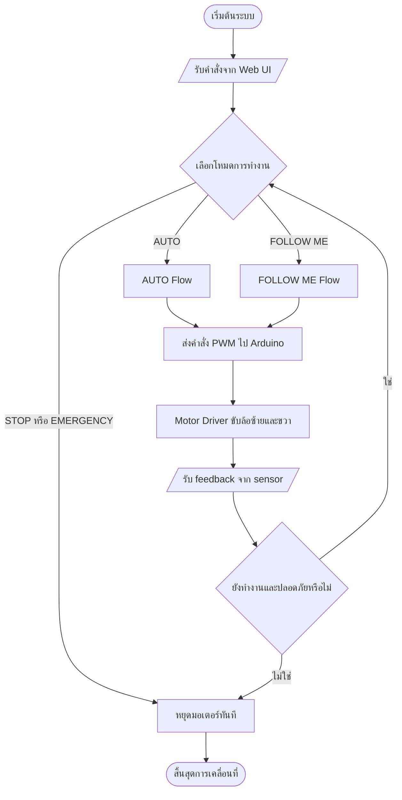
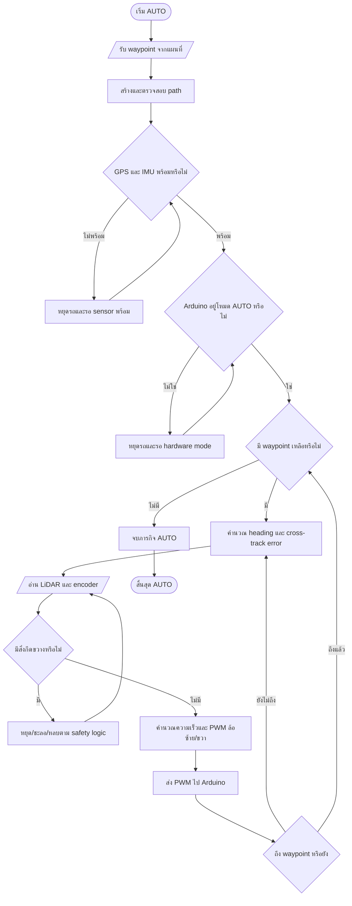
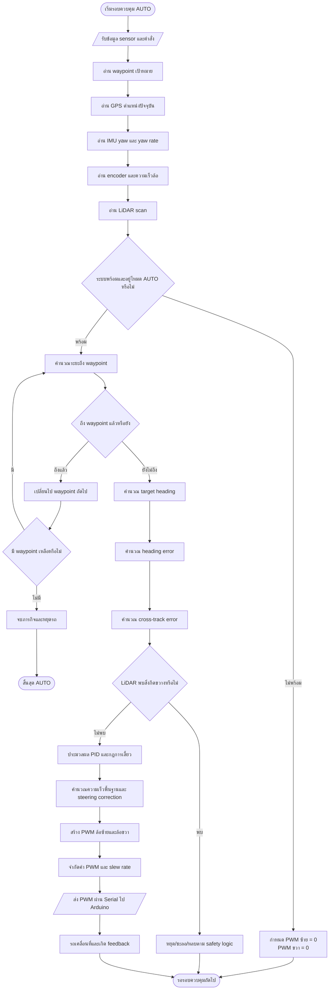
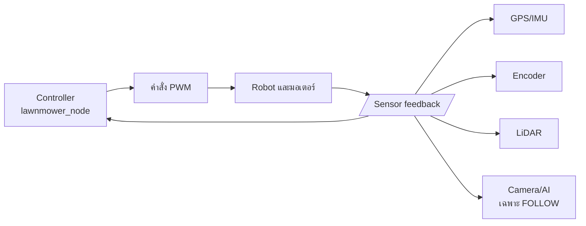
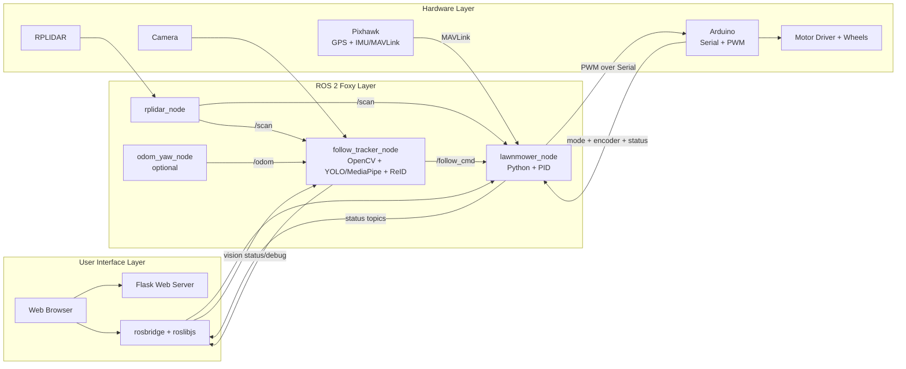

# Standard Flowchart: AUTO และ FOLLOW ME

## ประเภทของ Flowchart

ระบบนี้อธิบายได้ว่าเป็น:

1. **System Operational Flowchart**: แสดงลำดับการทำงานตั้งแต่ผู้ใช้สั่งงานจนถึงมอเตอร์
2. **Decision-Based Control Flowchart**: มีจุดตัดสินใจตรวจสอบความพร้อมและความปลอดภัย
3. **Closed-Loop Feedback Control**: รับ feedback จาก GPS, IMU, encoder, LiDAR และกล้อง แล้วปรับคำสั่งมอเตอร์ต่อเนื่อง

## สัญลักษณ์ที่ใช้

| รูปแบบ | ความหมายในแผนผัง |
|---|---|
| วงรี | จุดเริ่มต้นหรือสิ้นสุด |
| สี่เหลี่ยม | ขั้นตอนการประมวลผลหรือการควบคุม |
| สี่เหลี่ยมขนมเปียกปูน | จุดตรวจสอบเงื่อนไข/การตัดสินใจ |
| สี่เหลี่ยมด้านขนาน | ข้อมูลเข้า/ข้อมูลออก |
| ลูกศรวนกลับ | Feedback loop หรือการทำงานซ้ำ |

## 1. Flow หลักของระบบ



## 2. Flow มาตรฐานของ AUTO



**คำอธิบายสำหรับรายงาน:**

AUTO เป็น **waypoint-based autonomous navigation** โดยใช้ GPS/IMU สำหรับระบุตำแหน่งและทิศทาง,
ใช้ encoder ตรวจการเคลื่อนที่จริง และใช้ LiDAR เป็นชั้นความปลอดภัยก่อนส่ง PWM ไปยังมอเตอร์

## 3. Flow มาตรฐานของ FOLLOW ME


**คำอธิบายสำหรับรายงาน:**

FOLLOW ME เป็น **vision-based person following with LiDAR safety** โดยใช้กล้องและ AI
ตรวจจับ/ยืนยัน owner, ใช้ LiDAR ประเมินระยะและตรวจสิ่งกีดขวาง แล้วปรับ PWM แบบต่อเนื่อง
เพื่อรักษาทิศทางและระยะห่างจาก owner

## 4. Flow การประมวลผลภายใน AUTO

แผนผังนี้เน้นการคำนวณภายใน `lawnmower_node` หลังจากระบบได้รับคำสั่งเริ่ม AUTO แล้ว



### ข้อมูลที่ใช้ในการคำนวณ AUTO

| ขั้นตอน | ข้อมูลเข้า | ผลลัพธ์ |
|---|---|---|
| ระบุตำแหน่ง | GPS ปัจจุบัน + waypoint | ระยะและทิศทางไปเป้าหมาย |
| ระบุทิศทาง | target heading + IMU yaw | heading error |
| รักษาแนวเส้นทาง | ตำแหน่ง GPS + path | cross-track error |
| ตรวจการเคลื่อนที่ | encoder ซ้าย/ขวา | ความเร็วและระยะที่เคลื่อนที่จริง |
| ตรวจความปลอดภัย | LiDAR `/scan` | หยุด, ชะลอ หรืออนุญาตให้เคลื่อนที่ |
| สร้างคำสั่ง | error ต่าง ๆ + PID | PWM ล้อซ้าย/ขวา |

### สมการเชิงแนวคิดสำหรับรายงาน

```text
heading_error = target_heading - current_yaw
steering_correction = PID(heading_error, cross_track_error)
PWM_left  = base_speed + steering_correction
PWM_right = base_speed - steering_correction
```

ค่าจริงจะถูก normalize, จำกัดช่วง PWM และปรับ ramp ก่อนส่งไป Arduino เพื่อป้องกัน
การเปลี่ยนคำสั่งที่รุนแรงเกินไป

## 4. Feedback Loop ของระบบ



## 5. ประโยคสรุปสำหรับใส่รายงาน

> ระบบรถตัดหญ้านี้เป็นระบบควบคุมอัตโนมัติแบบแบ่งโหมดการทำงาน โดยโหมด AUTO ใช้การนำทางตาม waypoint และโหมด FOLLOW ME ใช้การตรวจจับบุคคลด้วยกล้องร่วมกับ LiDAR เพื่อกำหนดทิศทางและระยะห่าง การควบคุมเป็นแบบ closed-loop โดยรับข้อมูล feedback จาก GPS, IMU, encoder, LiDAR และกล้อง แล้วคำนวณคำสั่ง PWM สำหรับมอเตอร์อย่างต่อเนื่อง พร้อมมี decision logic สำหรับตรวจสอบความพร้อมและความปลอดภัยของระบบ

## 6. เทคโนโลยีที่ใช้ในระบบ

ส่วนนี้ควรแยกจาก Flowchart หลัก เพราะมีหน้าที่อธิบาย **เครื่องมือและเทคโนโลยีที่ใช้ประมวลผล** ไม่ใช่ลำดับการตัดสินใจของระบบ

| ส่วนระบบ | เทคโนโลยี/อุปกรณ์ | หน้าที่ |
|---|---|---|
| Middleware | ROS 2 Foxy | เชื่อม node, topic และข้อมูล sensor |
| Web control | Flask, HTML/JavaScript, roslibjs, rosbridge | หน้าเว็บ, แผนที่, ปุ่มสั่งงาน และสื่อสารกับ ROS |
| AUTO localization | GPS และ Pixhawk ผ่าน MAVLink | ตำแหน่งและทิศทางของรถ |
| AUTO control | Python, PID, waypoint/path control | คำนวณ heading, cross-track และ PWM |
| Obstacle safety | RPLIDAR และ `sensor_msgs/LaserScan` | ตรวจสิ่งกีดขวางและระยะด้านหน้า |
| FOLLOW detection | OpenCV, YOLO หรือ MediaPipe | รับภาพและตรวจจับบุคคล |
| FOLLOW identification | OSNet ReID, MobileNet และ color matching | ยืนยันว่าเป็น owner ที่เลือกไว้ |
| FOLLOW distance | กล้องร่วมกับ LiDAR | ประเมินทิศทางและระยะห่างจาก owner |
| Motor interface | Arduino, Serial และ PWM | รับคำสั่งล้อและควบคุมมอเตอร์ |
| Motion feedback | Encoder และ `/odom` | ตรวจการเคลื่อนที่จริงและช่วยปรับการควบคุม |

## 7. Technology Architecture



## 8. แนวทางจัดวางในรายงาน

เพื่อให้รายงานอ่านง่าย แนะนำแบ่งเป็น 3 รูป:

1. **System Flowchart**: ใช้ตอบว่า ระบบทำงานตามลำดับอย่างไร
2. **Technology Architecture**: ใช้ตอบว่า ระบบใช้ ROS 2, AI, sensor และ hardware อะไร
3. **Feedback Loop**: ใช้ตอบว่า sensor feedback กลับไปปรับคำสั่งมอเตอร์อย่างไร

ไม่ควรใส่ชื่อ library ทุกตัวลงใน Flowchart หลัก เพราะจะทำให้ผู้อ่านมองไม่เห็นลำดับการทำงาน
ให้ใส่ชื่อเทคโนโลยีไว้ใน Technology Architecture และตารางด้านบนแทน
