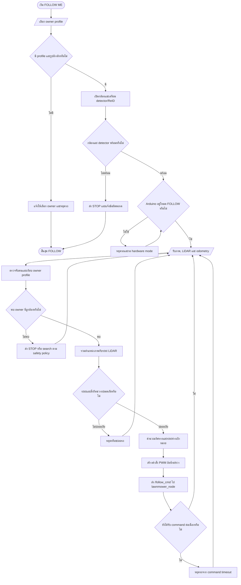
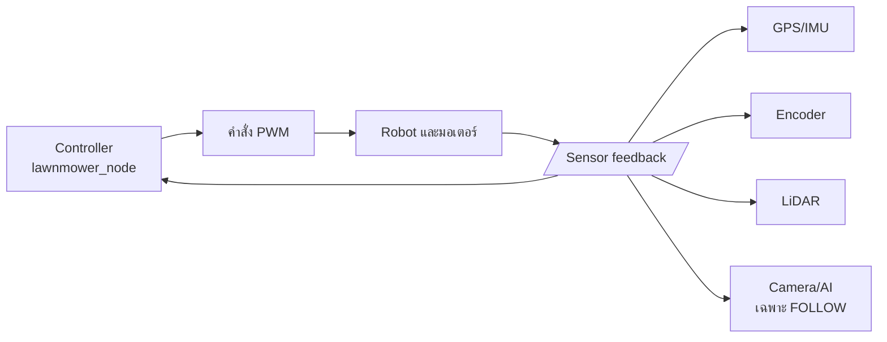

# Standard Flowchart: AUTO และ FOLLOW ME

## ประเภทของ Flowchart

ระบบนี้อธิบายได้ว่าเป็น:

1. **System Operational Flowchart**: แสดงลำดับการทำงานตั้งแต่ผู้ใช้สั่งงานจนถึงมอเตอร์
2. **Decision-Based Control Flowchart**: มีจุดตัดสินใจตรวจสอบความพร้อมและความปลอดภัย
3. **Closed-Loop Feedback Control**: รับ feedback จาก GPS, IMU, encoder, LiDAR และกล้อง แล้วปรับคำสั่งมอเตอร์ต่อเนื่อง

## สัญลักษณ์ที่ใช้

| รูปแบบ | ความหมายในแผนผัง |
|---|---|
| วงรี | จุดเริ่มต้นหรือสิ้นสุด |
| สี่เหลี่ยม | ขั้นตอนการประมวลผลหรือการควบคุม |
| สี่เหลี่ยมขนมเปียกปูน | จุดตรวจสอบเงื่อนไข/การตัดสินใจ |
| สี่เหลี่ยมด้านขนาน | ข้อมูลเข้า/ข้อมูลออก |
| ลูกศรวนกลับ | Feedback loop หรือการทำงานซ้ำ |

## 1. Flow หลักของระบบ

## 2. Flow มาตรฐานของ AUTO

**คำอธิบายสำหรับรายงาน:**

AUTO เป็น **waypoint-based autonomous navigation** โดยใช้ GPS/IMU สำหรับระบุตำแหน่งและทิศทาง,
ใช้ encoder ตรวจการเคลื่อนที่จริง และใช้ LiDAR เป็นชั้นความปลอดภัยก่อนส่ง PWM ไปยังมอเตอร์

## 3. Flow มาตรฐานของ FOLLOW ME

**คำอธิบายสำหรับรายงาน:**

FOLLOW ME เป็น **vision-based person following with LiDAR safety** โดยใช้กล้องและ AI
ตรวจจับ/ยืนยัน owner, ใช้ LiDAR ประเมินระยะและตรวจสิ่งกีดขวาง แล้วปรับ PWM แบบต่อเนื่อง
เพื่อรักษาทิศทางและระยะห่างจาก owner

## 4. Feedback Loop ของระบบ

## 5. ประโยคสรุปสำหรับใส่รายงาน

> ระบบรถตัดหญ้านี้เป็นระบบควบคุมอัตโนมัติแบบแบ่งโหมดการทำงาน โดยโหมด AUTO ใช้การนำทางตาม waypoint และโหมด FOLLOW ME ใช้การตรวจจับบุคคลด้วยกล้องร่วมกับ LiDAR เพื่อกำหนดทิศทางและระยะห่าง การควบคุมเป็นแบบ closed-loop โดยรับข้อมูล feedback จาก GPS, IMU, encoder, LiDAR และกล้อง แล้วคำนวณคำสั่ง PWM สำหรับมอเตอร์อย่างต่อเนื่อง พร้อมมี decision logic สำหรับตรวจสอบความพร้อมและความปลอดภัยของระบบ
