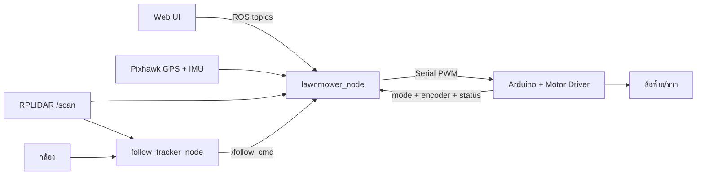
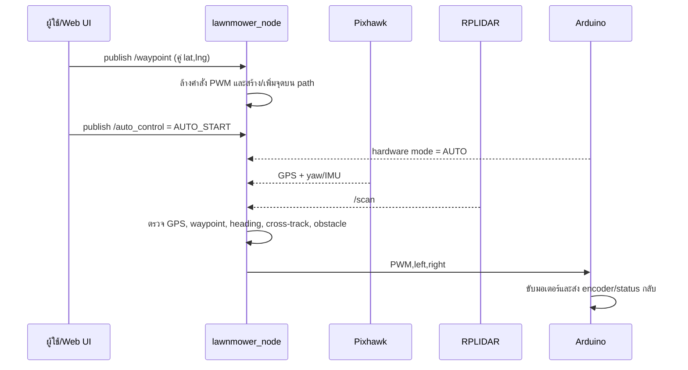
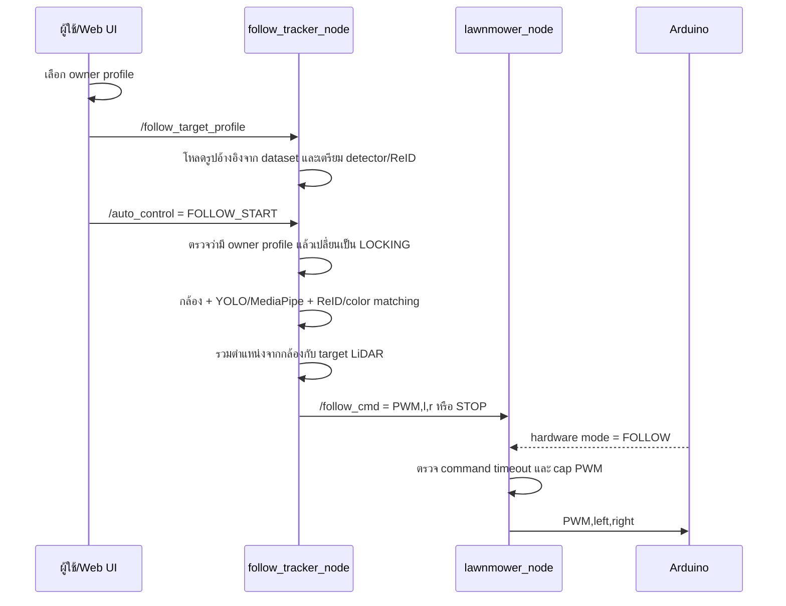

# คู่มือระบบ AUTO และ FOLLOW ME

เอกสารนี้อธิบายระบบจาก source code ที่อยู่ใน workspace ปัจจุบัน โดยเน้นให้เห็นว่า
คำสั่งเดินทางเข้าจากที่ใด ถูกตัดสินใจอย่างไร และสุดท้ายส่งไปยังมอเตอร์อย่างไร

> ขอบเขต: เอกสารนี้อ้างอิงโค้ดใน `src/` และ `web/` เท่านั้น ไฟล์ startup ของ Jetson,
> firmware Arduino และค่าจริงของเครื่องภาคสนามอาจอยู่นอก workspace นี้

## 1. สรุปสั้นที่สุด

ทั้ง AUTO และ FOLLOW ME ใช้เส้นทางควบคุมเดียวกัน:



จุดสำคัญคือ `lawnmower_node` เป็นผู้ส่ง PWM ไป Arduino เพียงจุดเดียว
`follow_tracker_node` ไม่ได้ขับมอเตอร์โดยตรง แต่ส่ง “ความตั้งใจในการเคลื่อนที่” ผ่าน `/follow_cmd`

## 2. ไฟล์หลักที่เกี่ยวข้อง

| ไฟล์ | หน้าที่ |
|---|---|
| [`lawnmower_node.py`](src/lawnmower_control/lawnmower_control/lawnmower_node.py) | ควบคุมโหมด, GPS/IMU, waypoint, LiDAR, encoder และ PWM |
| [`follow_tracker_node.py`](src/lawnmower_control/lawnmower_control/follow_tracker_node.py) | ตรวจจับคน, เลือก owner, ประเมินทิศทาง/ระยะ และสร้าง `/follow_cmd` |
| [`camera_lane_assist_node.py`](src/lawnmower_control/lawnmower_control/camera_lane_assist_node.py) | สร้าง steering bias จากภาพแบบเสริม ไม่ใช่ตัวขับมอเตอร์หลัก |
| [`setup.py`](src/lawnmower_control/setup.py) | ลงทะเบียน executable ของ ROS package |
| [`app_web.py`](web/app_web.py) | Flask backend, กล้อง, dataset และ rosbridge monitoring |
| [`index.html`](web/templates/index.html) | หน้าเว็บ map, waypoint, AUTO, FOLLOW และ emergency |
| [`rplidar_node.cpp`](src/rplidar_ros/src/rplidar_node.cpp) | driver RPLIDAR และ publisher `/scan` |
| [`odom_yaw_node.py`](src/odom_yaw/odom_yaw/odom_yaw_node.py) | โหนด odometry รุ่นเก่า/แยก ซึ่งอาจใช้ส่ง `/odom` ให้ FOLLOW |

โหนดที่ package `lawnmower_control` ลงทะเบียนไว้มี 3 ตัว:

```bash
ros2 run lawnmower_control lawnmower_node
ros2 run lawnmower_control follow_tracker_node
ros2 run lawnmower_control camera_lane_assist_node
```

## 3. สถานะโหมดที่ต้องเข้าใจ

มีสถานะจากสองแหล่งที่ต้องตรงกัน:

| ตัวแปร | มาจาก | ค่าที่เกี่ยวข้อง |
|---|---|---|
| `mode_hardware` | Arduino | `MANUAL=0`, `AUTO=1`, `FOLLOW=2`, `EMERGENCY=3` |
| `mode_web` | Web `/auto_control` | `START`, `STOP`, `PAUSE` |
| `web_run_mode` | คำสั่งเริ่มจาก Web | `AUTO` หรือ `FOLLOW` |

ระบบจะส่ง PWM เมื่อเงื่อนไขของโหมดครบเท่านั้น หากไม่ครบจะส่ง `0,0`

## 4. โหมด AUTO ทำงานอย่างไร

AUTO คือการขับตามเส้นทาง waypoint ที่สร้างจากแผนที่หรือ grid ใน Web UI

### 4.1 ลำดับการทำงาน



### 4.2 สิ่งที่ AUTO ใช้

- `/waypoint`: waypoint แบบ `Float32MultiArray` เป็นคู่ `lat,lng`
- Pixhawk: GPS สำหรับตำแหน่ง และ `ATTITUDE` สำหรับ yaw
- Encoder Arduino: ตรวจการเคลื่อนที่และความเร็วจริง
- `/scan`: ตรวจสิ่งกีดขวางและระยะด้านหน้า
- PID และ logic ใน `auto_drive()`: คุม heading, cross-track, ความเร็ว และการเลี้ยว
- path densification: เพิ่มจุดย่อยบนเส้นทางยาว เพื่อช่วยลดการตัดข้าม path

### 4.3 เงื่อนไขก่อนรถจะวิ่ง AUTO

ต้องมีทุกข้อ:

1. Arduino เชื่อมต่อและส่ง status frame อย่างน้อยหนึ่งครั้ง
2. hardware mode เป็น `AUTO`
3. Web mode เป็น `START`
4. `web_run_mode` เป็น `AUTO`
5. Pixhawk มี GPS ที่ผ่านช่วง warm-up/stable แล้ว
6. มี waypoint ใน `path_points`
7. ยังไม่อยู่ในสถานะ `PAUSE` หรือ emergency latch

เพียง upload waypoint ยังไม่ทำให้รถวิ่ง เพราะ `waypoint_cb()` จะหยุด PWM ก่อนเสมอ
ผู้ใช้ต้องกดเริ่ม AUTO แยกต่างหาก

### 4.4 การควบคุมการเลี้ยวและความปลอดภัย

- ปรับ heading ด้วย yaw/IMU และแก้ cross-track จากเส้นทาง
- มี waypoint reach, corner/turn policy และการจัดการ overshoot
- มีการจำกัด PWM, slew-rate และ profile สำหรับการเลี้ยว
- LiDAR ใช้ช่วยหยุด/หลบสิ่งกีดขวางตาม logic ใน `lawnmower_node.py`
- หาก GPS ยังไม่ stable, ไม่มี waypoint, hardware mode ไม่ตรง หรือ serial Arduino มีปัญหา รถจะหยุด

## 5. โหมด FOLLOW ME ทำงานอย่างไร

FOLLOW ME คือการให้รถติดตาม owner ที่เลือกไว้จากกล้อง ไม่ได้เดินตาม waypoint

### 5.1 ลำดับการเริ่ม FOLLOW



หน้าเว็บจะส่ง owner profile ซ้ำช่วงสั้น ๆ และส่ง `FOLLOW_START` ซ้ำ เพื่อป้องกัน
race ระหว่าง WebSocket บนโทรศัพท์กับ ROS topic

### 5.2 สิ่งที่ FOLLOW ใช้

- กล้องแบบ snapshot, MJPEG หรือ USB ตาม environment
- YOLO เป็น detector หลัก หากใช้ไม่ได้อาจ fallback ไป MediaPipe
- ReID: OSNet ONNX หรือ MobileNet/color matcher ตาม model และ library ที่พร้อม
- owner profile ใน dataset สำหรับเทียบคนที่เลือก
- `/scan`: ตรวจ obstacle, target LiDAR และระยะหน้ารถ
- `/odom`: ใช้ช่วย yaw/search หากมีโหนด odometry publish อยู่

### 5.3 คำสั่งจาก tracker ไป main

`/follow_cmd` เป็น `std_msgs/String` และรองรับ:

| ค่า | ความหมาย |
|---|---|
| `PWM,left,right` | PWM ล้อซ้าย/ขวาโดยตรง เช่น `PWM,92,80` |
| `FORWARD` | เดินหน้าด้วยค่า default |
| `BACK` | ถอยหลัง |
| `LEFT` / `RIGHT` | หมุน/เลี้ยว |
| `STOP` | หยุด |

ก่อนส่งไป Arduino, `lawnmower_node` จะจำกัดค่า PWM, ทำ slew-rate limiting และ map polarity
ของล้อให้ตรงกับการติดตั้งจริง

### 5.4 Logic การติดตาม

1. ตรวจว่ากล้องเปิดได้และมีภาพใหม่
2. ตรวจจำนวนคนในภาพ
3. เทียบคนกับ owner profile ที่เลือก
4. ใช้ตำแหน่งศูนย์กลางภาพเพื่อเลี้ยวซ้าย/ขวา
5. ใช้ขนาดไหล่/กรอบคนและ target LiDAR เพื่อประมาณระยะ
6. รักษาระยะห่างเป้าหมาย โดยค่า default ที่เห็นในโค้ดคือ ideal ประมาณ `1.45 m`
7. ส่ง PWM ที่เหมาะกับทิศทางและความเร็ว

ถ้าตรวจ owner ไม่ผ่าน จะไม่ติดตามคนอื่นแบบเงียบ ๆ และจะส่ง `STOP`

## 6. Safety และกรณีรถหยุด

| เหตุการณ์ | ผลลัพธ์ |
|---|---|
| ไม่มี Arduino status หรือ serial timeout | PWM เป็น `0,0` |
| hardware mode ไม่ตรงกับโหมดที่เริ่ม | PWM เป็น `0,0` |
| AUTO ไม่มี GPS stable | หยุดรอ |
| AUTO ไม่มี waypoint | หยุดรอ |
| FOLLOW ไม่มี `/follow_cmd` ใหม่เกิน timeout | หยุดรอ tracker |
| กล้องหาย/ไม่มี owner/owner score ไม่ผ่าน | tracker ส่ง `STOP` |
| LiDAR ตรวจสิ่งกีดขวางใกล้ | หยุดหรือจำกัดการเคลื่อนที่ |
| `PAUSE` | หยุดชั่วคราวและยังเก็บสถานะ mission |
| `STOP` | หยุดและ reset state ของ AUTO/FOLLOW |
| `EMERGENCY` | latch emergency, ยกเลิก mission และส่ง `EMG` ไป Arduino |
| `RESET` | ปลด emergency แต่ต้อง upload path และกด START ใหม่สำหรับ AUTO |

ค่าที่สำคัญของ FOLLOW จาก default ใน source:

| ค่า | Default โดยประมาณ |
|---|---:|
| `FOLLOW_LIDAR_STOP_M` | `2.0 m` |
| `FOLLOW_LIDAR_HARD_STOP_M` | `1.05 m` |
| `FOLLOW_LIDAR_ANY_HARD_STOP_M` | `0.38 m` |
| `FOLLOW_TARGET_IDEAL_M` | `1.45 m` |
| `FOLLOW_LOST_TIMEOUT_S` | `1.8 s` |
| `FOLLOW_BLIND_HOLD_S` | `0.10 s` |
| `FOLLOW_ALLOW_BACKOFF` | ปิด (`0`) |

ค่าจริงสามารถเปลี่ยนได้ด้วย environment variables กลุ่ม `AUTO_*`, `FOLLOW_*`,
`LIDAR_*`, `ARDUINO_*` และ `PIXHAWK_*` โดยโค้ดกลุ่มนี้ใช้ `os.getenv()` เป็นหลัก
ไม่ใช่ ROS parameters ทั้งหมด

## 7. Topic ที่ควรรู้

| Topic | Type | ทิศทาง | หน้าที่ |
|---|---|---|---|
| `/auto_control` | `std_msgs/String` | Web -> main/tracker | `START`, `AUTO_START`, `FOLLOW_START`, `PAUSE`, `STOP` |
| `/waypoint` | `Float32MultiArray` | Web -> main | ส่งคู่ `lat,lng` ของเส้นทาง |
| `/follow_target_profile` | `std_msgs/String` | Web -> tracker | เลือก owner |
| `/follow_cmd` | `std_msgs/String` | tracker -> main | คำสั่งเคลื่อนที่ของ FOLLOW |
| `/scan` | `sensor_msgs/LaserScan` | RPLIDAR -> main/tracker | obstacle และระยะ target |
| `/odom` | `nav_msgs/Odometry` | odom node -> tracker | yaw/motion feedback แบบ optional |
| `/current_gps` | `Float32MultiArray` | main -> Web | GPS, yaw, PWM, mode และสถานะรวม |
| `/follow_vision_status` | `std_msgs/String` | tracker -> Web | สถานะ `IDLE`, `LOCKING`, `HOLD_DISTANCE` ฯลฯ |
| `/follow_debug` | `std_msgs/String` | tracker -> Web | detector, score, target range และ debug |
| `/emergency_stop` | `std_msgs/String` | Web -> main | `EMERGENCY` หรือ `RESET` |
| `/lidar_safety_enable` | `std_msgs/Bool` | Web -> main/tracker | เปิด/ปิด LiDAR safety |

## 8. วิธีแยกปัญหาแบบเร็ว

### AUTO ไม่วิ่ง

ตรวจตามลำดับ:

1. Arduino ส่ง status frame แล้วหรือยัง
2. hardware switch อยู่ `AUTO` หรือไม่
3. มี `/waypoint` หลังจาก upload หรือไม่
4. ส่ง `AUTO_START` แล้วหรือยัง
5. Pixhawk มี GPS stable และ yaw หรือไม่
6. มี log `START but no waypoint`, `Waiting GPS stable` หรือ `START blocked` หรือไม่

### FOLLOW ไม่วิ่ง

ตรวจตามลำดับ:

1. เลือก owner profile และ profile มีรูปอ้างอิงหรือไม่
2. `follow_tracker_node` เริ่มทำงานหรือไม่
3. hardware switch อยู่ `FOLLOW` หรือไม่
4. สถานะเป็น `OWNER READY`, `LOCKING` หรือ `FOLLOW ACTIVE` หรือไม่
5. กล้องส่งภาพและ detector โหลด model สำเร็จหรือไม่
6. owner score ผ่าน threshold หรือกลายเป็น `WRONG_TARGET` หรือไม่
7. `lawnmower_node` รายงาน `FOLLOW WAIT TRACKER: no /follow_cmd` หรือไม่
8. LiDAR กำลังสั่งหยุดจาก obstacle หรือไม่

## 9. ขอบเขตและสิ่งที่ต้องตรวจบนเครื่องจริง

- เอกสารเดิมอ้างถึง `auto_start_mower.sh` และ Arduino firmware ที่อยู่นอก source tree นี้
- `odom_yaw` มีโค้ด publish `/odom` แต่ต้องตรวจว่า startup ปัจจุบัน launch โหนดนี้จริงหรือไม่
- `px4_mavros_bridge` และ `my_mavros_launch` เป็นเส้นทางแยก/ทดลอง ไม่ใช่เส้นทาง PWM หลักที่ยืนยันจาก `lawnmower_node.py`
- ต้องตรวจค่า port จริงของ Arduino, Pixhawk, RPLIDAR และ URL กล้องจาก environment/startup บน Jetson
- ก่อนทดสอบกับใบมีดหรือพื้นที่จริง ควรทดสอบด้วยมอเตอร์ยกจากพื้นและยืนยัน `STOP`/`EMERGENCY` ก่อนเสมอ

## 10. Flowchart สำหรับรายงาน

ดูแผนผังแบบมาตรฐานที่จัดรูปแบบสำหรับนำไปใส่รายงานได้ที่
[`AUTO_FOLLOW_STANDARD_FLOWCHART.md`](AUTO_FOLLOW_STANDARD_FLOWCHART.md)
