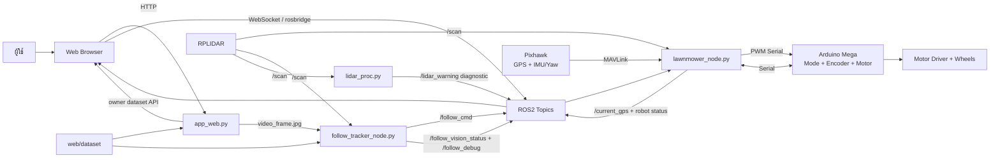
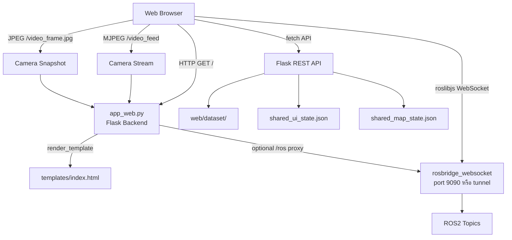
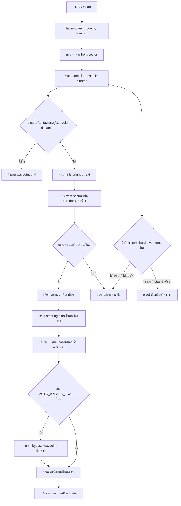
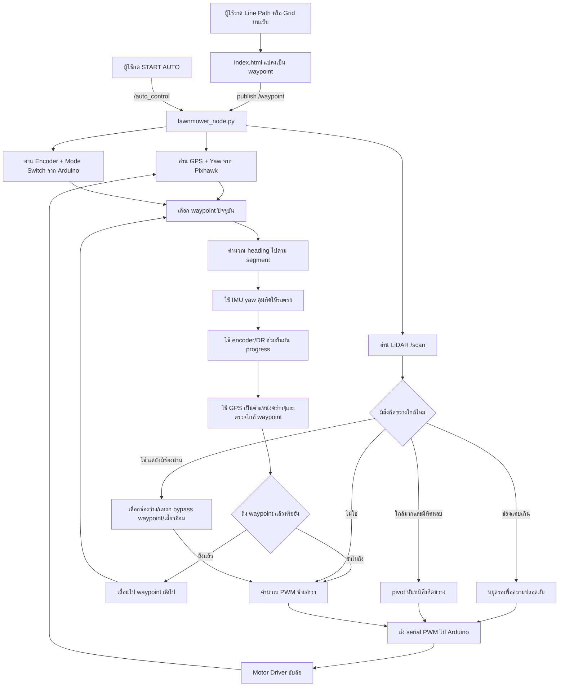
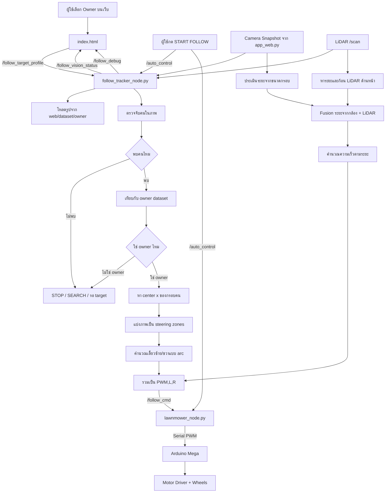
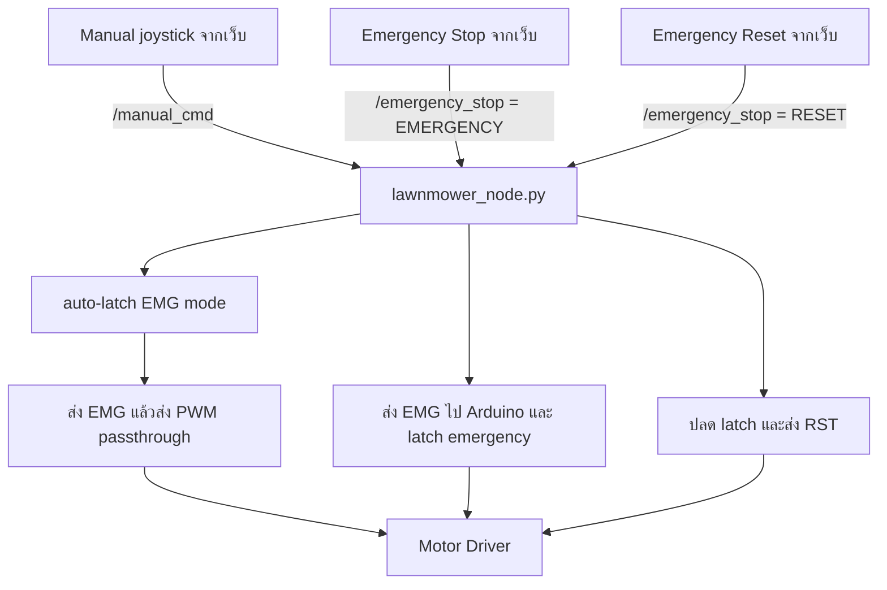
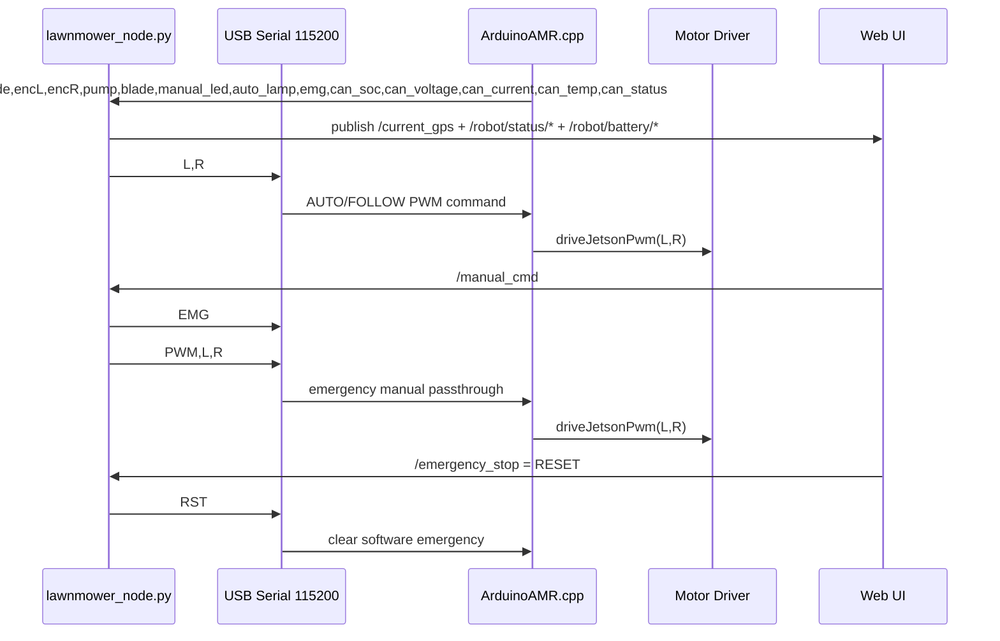
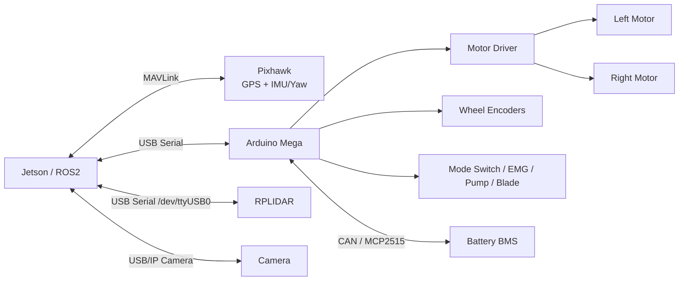

# AMR Lawn Mower System Structure

เอกสารนี้สรุปโครงสร้างระบบรถตัดหญ้าอัตโนมัติแบบปัจจุบัน โดยรวมทั้ง flow การเปิด Jetson, ไฟล์ที่ใช้จริง, node ที่รัน, topic ที่ส่งข้อมูล และการไหลของคำสั่งในโหมด AUTO / FOLLOW ME

## 1. ภาพรวมตอนเปิด Jetson

เมื่อเปิด Jetson แล้วเข้า desktop session ระบบจะเรียก autostart file:

- `/home/iai/.config/autostart/auto_start_mower.sh.desktop`

ไฟล์นี้มีคำสั่ง:

```ini
Exec=/home/iai/auto_start_mower.sh
```

จากนั้น `/home/iai/auto_start_mower.sh` จะรอ 10 วินาที, source ROS2 Foxy และ workspace แล้วเปิด terminal หลายหน้าต่างเพื่อรันระบบหลัก

```mermaid
flowchart TD
    A[เปิด Jetson] --> B[เข้าสู่ Desktop Session]
    B --> C[GNOME Autostart]
    C --> D[/home/iai/.config/autostart/auto_start_mower.sh.desktop]
    D --> E[/home/iai/auto_start_mower.sh]
    E --> F[sleep 10]
    F --> G[source /opt/ros/foxy/setup.bash]
    G --> H[source ~/ros2_foxy_ws/install/setup.bash]

    H --> I[Terminal 1<br/>rosbridge_websocket]
    H --> J[Terminal 2<br/>lawnmower_node]
    H --> K[Terminal 3<br/>follow_tracker_node]
    H --> L[Terminal 4<br/>rplidar_node]
    H --> M[Terminal 5<br/>lidar_proc.py]
    H --> N[Terminal 6<br/>app_web.py]
    H --> O[Terminal 7<br/>cloudflared tunnel]
```

## 2. โปรแกรมที่รันตอนเปิดเครื่อง

| ลำดับ | คำสั่งที่รัน | ไฟล์ / Package | หน้าที่ |
|---|---|---|---|
| 1 | `ros2 run rosbridge_server rosbridge_websocket` | ROS package: `rosbridge_server` | เปิด WebSocket ให้หน้าเว็บคุยกับ ROS topic |
| 2 | `ros2 run lawnmower_control lawnmower_node` | `src/lawnmower_control/lawnmower_control/lawnmower_node.py` | node หลักของรถ คุม AUTO, MANUAL, FOLLOW, GPS, IMU, encoder, LiDAR safety, PWM |
| 3 | `ros2 run lawnmower_control follow_tracker_node` | `src/lawnmower_control/lawnmower_control/follow_tracker_node.py` | ตรวจจับ owner จากกล้อง, fusion LiDAR, ส่ง `/follow_cmd` |
| 4 | `ros2 run rplidar_ros rplidar_node ...` | `src/rplidar_ros` | อ่าน RPLIDAR จาก `/dev/ttyUSB0` แล้ว publish `/scan` |
| 5 | `python3 lidar_proc.py` | `/home/iai/ros2_foxy_ws/lidar_proc.py` | ประมวลผล `/scan` เพิ่มเติม และ publish `/lidar_warning` |
| 6 | `python3 app_web.py` | `/home/iai/ros2_foxy_ws/web/app_web.py` | Flask web server, camera snapshot, owner dataset API |
| 7 | `cloudflared tunnel run lawnmower` | Cloudflare Tunnel | เปิดเว็บ/ROS ให้เข้าจาก domain ภายนอก |

ค่าที่ script export ให้ระบบหลัก:

```bash
AUTO_STEER_INVERT=1
AUTO_PWM_SWAP_LR=1
AUTO_PWM_INVERT_L=0
AUTO_PWM_INVERT_R=0
FOLLOW_CAMERA_MODE=snapshot
FOLLOW_CAMERA_SNAPSHOT_URL=http://127.0.0.1:8080/video_frame.jpg
```

## 3. โครงสร้างไฟล์หลัก

```mermaid
flowchart TD
    WS[/home/iai/ros2_foxy_ws] --> Startup[/home/iai/auto_start_mower.sh]
    WS --> SRC[src/]
    WS --> WEB[web/]
    WS --> LIDAR[lidar_proc.py]
    WS --> INSTALL[install/]

    SRC --> LC[lawnmower_control]
    LC --> Main[lawnmower_node.py]
    LC --> Follow[follow_tracker_node.py]
    LC --> LCSetup[setup.py]

    SRC --> RPLIDAR[rplidar_ros]
    SRC --> ODOM[odom_yaw]
    SRC --> MAVROS[my_mavros_launch]
    SRC --> PX4Bridge[px4_mavros_bridge]

    WEB --> App[app_web.py]
    WEB --> Index[templates/index.html]
    WEB --> EStick[static/js/emer_stick.js]
    WEB --> Dataset[dataset/]
    WEB --> UIState[shared_ui_state.json]
    WEB --> MapState[shared_map_state.json]

    Arduino[/home/iai/Documents/PlatformIO/Projects/AMR] --> ArduinoCode[src/ArduinoAMR.cpp]
    Arduino --> PIO[platformio.ini]
```

## 4. ไฟล์ที่ใช้จริงใน runtime

| กลุ่ม | Path | บทบาท |
|---|---|---|
| Startup | `/home/iai/.config/autostart/auto_start_mower.sh.desktop` | จุดที่ Jetson เรียก script หลัง login |
| Startup | `/home/iai/auto_start_mower.sh` | เปิด ROSBridge, node หลัก, Follow, LiDAR, Web, Cloudflare |
| ROS main | `/home/iai/ros2_foxy_ws/src/lawnmower_control/lawnmower_control/lawnmower_node.py` | ควบคุมรถจริงทั้งหมด |
| ROS follow | `/home/iai/ros2_foxy_ws/src/lawnmower_control/lawnmower_control/follow_tracker_node.py` | AI Follow Me และ owner matching |
| ROS package | `/home/iai/ros2_foxy_ws/src/lawnmower_control/setup.py` | กำหนด command `lawnmower_node` และ `follow_tracker_node` |
| LiDAR | `/home/iai/ros2_foxy_ws/src/rplidar_ros` | driver RPLIDAR สำหรับ publish `/scan` |
| LiDAR process | `/home/iai/ros2_foxy_ws/lidar_proc.py` | node เสริมสำหรับ warning จาก LiDAR |
| Web server | `/home/iai/ros2_foxy_ws/web/app_web.py` | Flask server, camera, dataset API |
| Web UI | `/home/iai/ros2_foxy_ws/web/templates/index.html` | หน้าเว็บควบคุม, map, grid, follow UI |
| Web JS | `/home/iai/ros2_foxy_ws/web/static/js/emer_stick.js` | joystick / emergency stick UI |
| Web state | `/home/iai/ros2_foxy_ws/web/shared_ui_state.json` | จำสถานะ UI |
| Web state | `/home/iai/ros2_foxy_ws/web/shared_map_state.json` | จำ waypoint/map state |
| Dataset | `/home/iai/ros2_foxy_ws/web/dataset/` | รูป owner สำหรับ Follow Me ห้ามลบ |
| Arduino | `/home/iai/Documents/PlatformIO/Projects/AMR/src/ArduinoAMR.cpp` | firmware อ่าน switch/encoder และขับ motor |
| Arduino build | `/home/iai/Documents/PlatformIO/Projects/AMR/platformio.ini` | config build/upload Arduino Mega |

## 5. Package ที่มีใน workspace

| Package | สถานะ | หน้าที่ |
|---|---|---|
| `lawnmower_control` | ใช้งานจริงตอนเปิดเครื่อง | node หลักและ Follow Me |
| `rplidar_ros` | ใช้งานจริงตอนเปิดเครื่อง | driver RPLIDAR |
| `odom_yaw` | มีใน workspace แต่ไม่ได้ถูก `auto_start_mower.sh` เรียกตอนนี้ | odometry จาก encoder + yaw แยก package มี entry point `odom_yaw_node` |
| `my_mavros_launch` | มีใน workspace แต่ไม่ได้ถูก `auto_start_mower.sh` เรียกตอนนี้ | launch file `launch/px4.launch.py` สำหรับ MAVROS/Pixhawk |
| `px4_mavros_bridge` | มีใน workspace แต่ไม่ได้ถูก `auto_start_mower.sh` เรียกตอนนี้ | package/launch ทดลอง bridge PX4/MAVROS และมี `px4_mavros_bridge/lawnmower_node.py` เก่า |

## 6. ภาพรวมการส่งข้อมูล



## 7. Web System

เว็บของระบบมีโค้ด 2 ส่วนหลัก คือ Flask backend และหน้าเว็บ frontend



### Web Backend: `app_web.py`

`app_web.py` เป็น Flask server ที่ถูกเปิดจาก `/home/iai/auto_start_mower.sh` ด้วยคำสั่ง:

```bash
cd ~/ros2_foxy_ws/web && python3 app_web.py
```

หน้าที่หลัก:

- เสิร์ฟหน้าเว็บหลัก `/` ด้วย `templates/index.html`
- เปิด API จัดการ owner dataset เช่น `/api/profiles`, `/api/capture_owner`, `/api/delete_folder`
- เก็บและโหลดสถานะเว็บผ่าน `/api/ui_state` และ `/api/map_state`
- เสิร์ฟรูป dataset ผ่าน `/dataset/<path>`
- เสิร์ฟกล้องผ่าน `/video_feed` และ `/video_frame.jpg`
- มี WebSocket proxy `/ros` สำหรับส่งต่อไป `ws://127.0.0.1:9090` แต่หน้าเว็บปัจจุบันใช้ `roslibjs` ต่อ ROSBridge โดยตรงหรือผ่าน Cloudflare tunnel เป็นหลัก

### Web Frontend: `index.html`

`index.html` เป็นหน้า UI หลักของรถ ทำหน้าที่:

- วาดแผนที่, waypoint, line path, grid path
- ส่งคำสั่ง AUTO/FOLLOW/MANUAL/EMERGENCY ผ่าน ROS topic
- อ่าน `/current_gps` เพื่ออัปเดตตำแหน่งรถ, yaw, PWM, battery, LiDAR status
- อ่าน `/follow_vision_status` และ `/follow_debug` เพื่อแสดงสถานะ Follow Me
- เรียก Flask API เพื่อจัดการ owner dataset และจำสถานะหน้าเว็บ
- แสดงกล้องจาก `/video_feed` หรือ snapshot `/video_frame.jpg`

Topic ที่หน้าเว็บ publish ผ่าน `roslibjs`:

| Topic | ใช้ทำอะไร |
|---|---|
| `/waypoint` | ส่ง waypoint จาก line path/grid ไปให้ AUTO |
| `/auto_control` | START/STOP/AUTO_START/FOLLOW_START/FOLLOW_PAUSE |
| `/manual_cmd` | joystick/manual command |
| `/emergency_stop` | EMERGENCY/RESET |
| `/safety_distance_cm` | ตั้งระยะ safety LiDAR |
| `/lidar_max_use_m` | จำกัดระยะ LiDAR สูงสุดที่ใช้ |
| `/lidar_safety_enable` | เปิด/ปิด LiDAR safety |
| `/follow_target_profile` | เลือก owner สำหรับ Follow Me |
| `/yaw_offset_deg`, `/yaw_offset_adjust_deg` | topic ปรับ yaw ที่หน้าเว็บยัง publish ได้ แต่ในโค้ดหลักปัจจุบัน ignore yaw compensation แล้ว |

Topic ที่หน้าเว็บ subscribe ผ่าน `roslibjs`:

| Topic | ใช้แสดงอะไร |
|---|---|
| `/current_gps` | ตำแหน่งรถ, yaw, status, PWM, target waypoint, battery |
| `/scan` | แสดง/ประมวลผลภาพรวม LiDAR บน UI |
| `/follow_vision_status` | สถานะ target/follow |
| `/follow_debug` | owner score, match mode, steering zone, debug Follow Me |

## 8. Topic หลักของระบบ

| Topic | Type | Publisher | Subscriber | หน้าที่ |
|---|---|---|---|---|
| `/waypoint` | `Float32MultiArray` | Web UI | `lawnmower_node.py` | ส่ง waypoint จาก map/grid/line path |
| `/auto_control` | `String` | Web UI | `lawnmower_node.py`, `follow_tracker_node.py` | START/STOP/AUTO/FOLLOW |
| `/manual_cmd` | `String` | Web UI | `lawnmower_node.py` | สั่ง manual เดินหน้า/ถอย/เลี้ยว/หยุด |
| `/emergency_stop` | `String` | Web UI | `lawnmower_node.py` | หยุดฉุกเฉิน |
| `/follow_target_profile` | `String` | Web UI | `follow_tracker_node.py` | เลือก owner dataset |
| `/follow_cmd` | `String` | `follow_tracker_node.py` | `lawnmower_node.py` | ส่ง PWM หรือ STOP สำหรับ Follow Me |
| `/follow_vision_status` | `String` | `follow_tracker_node.py` | Web UI | สถานะตรวจจับคน/owner |
| `/follow_debug` | `String` | `follow_tracker_node.py` | Web UI | debug score, owner match, steering zone |
| `/scan` | `LaserScan` | `rplidar_node` | `lawnmower_node.py`, `follow_tracker_node.py`, `lidar_proc.py` | ข้อมูล LiDAR |
| `/lidar_safety_enable` | `Bool` | Web UI | `lawnmower_node.py`, `follow_tracker_node.py` | เปิด/ปิด safety จาก LiDAR |
| `/safety_distance_cm` | `Float32` | Web UI | `lawnmower_node.py` | ระยะหยุดสิ่งกีดขวาง |
| `/lidar_max_use_m` | `Float32` | Web UI | `lawnmower_node.py` | ระยะ LiDAR สูงสุดที่ใช้ |
| `/lidar_warning` | `Float32` | `lidar_proc.py` | ไม่มี subscriber หลักใน flow ปัจจุบัน | warning/diagnostic จาก LiDAR process |
| `/current_gps` | `Float32MultiArray` | `lawnmower_node.py` | Web UI | GPS, yaw, PWM, status, target point |
| `/robot/status/mode` | `Float32` | `lawnmower_node.py` | Web UI | mode switch จาก Arduino |
| `/robot/status/enc_l` | `Float32` | `lawnmower_node.py` | Web UI | encoder ซ้าย |
| `/robot/status/enc_r` | `Float32` | `lawnmower_node.py` | Web UI | encoder ขวา |
| `/robot/status/pump` | `Bool` | `lawnmower_node.py` | Web UI | สถานะปั๊ม |
| `/robot/status/blade` | `Float32` | `lawnmower_node.py` | Web UI | สถานะใบมีด |
| `/robot/status/emg` | `Bool` | `lawnmower_node.py` | Web UI | สถานะ emergency |
| `/robot/battery/soc` | `Float32` | `lawnmower_node.py` | Web UI | battery percentage |
| `/robot/battery/voltage` | `Float32` | `lawnmower_node.py` | Web UI | battery voltage |
| `/robot/battery/current` | `Float32` | `lawnmower_node.py` | Web UI | battery current |
| `/robot/battery/temp` | `Float32` | `lawnmower_node.py` | Web UI | battery temperature |
| `/robot/battery/status` | `Float32` | `lawnmower_node.py` | Web UI | battery status |

## 9. AUTO Obstacle Avoidance



ระบบหลบสิ่งกีดขวางใน AUTO เป็นแบบ reactive local avoidance ไม่ใช่ global path planning ทั้งสนาม หมายความว่ารถจะใช้ LiDAR ดูพื้นที่ด้านหน้า เลือกช่องที่โล่งกว่า แล้วเลี้ยวอ้อมเฉพาะหน้า ถ้าเปิด `AUTO_BYPASS_ENABLE` ระบบจะแทรก waypoint ชั่วคราวเพื่อเดินออกข้าง ผ่านสิ่งกีดขวาง แล้วกลับเข้าเส้นเดิม

ค่า default ปัจจุบันเปิด `AUTO_BYPASS_ENABLE=1` แล้ว ดังนั้นงานจริงจะมี behavior เดินอ้อม ไม่ใช่แค่หยุดเฉยๆ แต่ถ้าช่องแคบกว่าตัวรถ ระบบจะหยุดรอช่องปลอดภัย และถ้าสิ่งกีดขวางเข้าใกล้มากใน hard pivot zone ระบบจะ pivot หันหนีเมื่อมีทิศทางหลบที่ชัดเจน

## 10. Flow โหมด AUTO



หลักการ AUTO ปัจจุบัน:

- ใช้ `GPS` เป็นตำแหน่งหลักบนแผนที่ แต่ไม่เชื่อ GPS warp ทันที
- ใช้ `IMU yaw` เป็นตัวถือทิศทางเวลาเดินตามเส้น
- ใช้ `encoder/dead reckoning` ช่วยยืนยันว่าเคลื่อนผ่าน segment/waypoint จริง
- ใช้ LiDAR ทำ reactive obstacle avoidance โดยเลือก corridor ที่โล่งกว่า, เลี้ยว arc อ้อมสิ่งกีดขวาง และสามารถแทรก bypass waypoint ชั่วคราวเพื่อออกข้างแล้วกลับเข้าเส้นเดิม
- ถ้าช่องว่างแคบกว่าตัวรถ ระบบจะหยุดรอ และถ้าสิ่งกีดขวางใกล้มากแต่มีทิศหลบชัดเจน ระบบจะ pivot หันหนีแทนการฝืนเดินชน
- ลดการยึกยักตอนเข้า waypoint โดยให้เข้าใกล้พอเหมาะและ handoff ไปจุดถัดไป
- Grid spacing ถูกปรับให้กว้างขึ้นเพราะ GPS มี error ประมาณ 2-3 เมตร

## 11. Flow โหมด FOLLOW ME



หลักการ FOLLOW ME ปัจจุบัน:

- ใช้ owner dataset เพื่อแยกคนที่เลือกกับคนอื่น
- กรอบสีเขียวหมายถึง match owner, กรอบสีแดงหมายถึงคนที่ไม่ใช่ owner หรือ score ไม่ผ่าน
- ใช้กล้องคุมทิศทางซ้าย/ขวาเป็นหลัก
- ใช้ LiDAR fusion เพื่อช่วยเรื่องระยะและความนิ่ง
- คำสั่งวิ่งเป็น arc PWM เช่น ล้อด้านนอกเร็ว ด้านในช้า เพื่อเลี้ยวตามคนแบบนิ่มกว่า pivot turn
- ความเร็วถูกจำกัดให้เหมาะกับคนเดิน ไม่ใช้ PWM 255 เป็นหลัก

## 12. Flow Manual / Emergency



## 13. Jetson-Arduino Serial Protocol

Jetson และ Arduino Mega คุยกันผ่าน USB Serial ที่ baudrate `115200` โดย `lawnmower_node.py` เป็นฝั่งส่งคำสั่งขับเคลื่อน และ `ArduinoAMR.cpp` เป็นฝั่งรับคำสั่ง/ส่งสถานะกลับ



คำสั่งที่ Jetson ส่งไป Arduino:

| Serial command | ใช้เมื่อ | ความหมาย |
|---|---|---|
| `L,R` | AUTO/FOLLOW ปกติ | PWM ซ้าย/ขวาหลัง map polarity แล้ว เช่น `80,80` |
| `EMG` | Emergency/manual joystick | latch software emergency บน Arduino |
| `RST` | Reset emergency | ปลด software emergency |
| `PWM,L,R` | Manual joystick จากเว็บ | คำสั่ง PWM passthrough ขณะอยู่ emergency manual |

สถานะที่ Arduino ส่งกลับมาเป็น CSV:

```text
mode,encL,encR,pump,blade,manual_led,auto_lamp,emg,can_soc,can_voltage,can_current,can_temp,can_status
```

ข้อมูลนี้ถูก `lawnmower_node.py` parse แล้ว publish ต่อเป็น `/current_gps`, `/robot/status/*` และ `/robot/battery/*` เพื่อให้หน้าเว็บแสดง mode, encoder, pump, blade, emergency และ battery/BMS telemetry

Arduino ยังอ่าน CAN ผ่าน MCP2515 เพื่อดึงข้อมูล BMS เช่น SOC, voltage, current, temperature และ status แล้วรวมส่งกลับมาใน serial status line

## 14. Hardware Interface



## 15. บทบาทของไฟล์สำคัญ

### `lawnmower_node.py`

เป็น core controller ของรถ ทำหน้าที่:

- รับคำสั่ง AUTO/FOLLOW/MANUAL จากเว็บ
- รับ waypoint จาก `/waypoint`
- อ่าน GPS และ yaw จาก Pixhawk
- อ่าน mode switch, encoder, battery/status จาก Arduino
- อ่าน LiDAR `/scan` เพื่อ safety
- คำนวณ PWM ซ้าย/ขวา
- ส่งคำสั่ง serial ไป Arduino
- publish `/current_gps` และ robot status กลับไปหน้าเว็บ

### `follow_tracker_node.py`

เป็น node สำหรับ Follow Me ทำหน้าที่:

- รับ owner profile จาก `/follow_target_profile`
- โหลดรูป owner จาก `web/dataset/`
- อ่านภาพจาก snapshot ของ `app_web.py`
- ตรวจจับคนและ match owner
- ใช้ LiDAR `/scan` ช่วย fusion ระยะ
- ส่งคำสั่ง `/follow_cmd` เป็น PWM ให้ `lawnmower_node.py`
- publish debug/status ให้หน้าเว็บดูว่าจับคนถูกไหม

### `app_web.py`

เป็น Flask server ทำหน้าที่:

- เปิดหน้าเว็บควบคุม
- ส่ง camera frame/snapshot ให้ browser และ follow node
- จัดการ owner dataset
- วาดกรอบ owner/non-owner overlay
- เก็บ/โหลด shared UI state และ map state

### `index.html`

เป็นหน้า Web UI ทำหน้าที่:

- แสดง map และตำแหน่งรถ
- วาด line path / grid waypoint
- publish `/waypoint`, `/auto_control`, `/manual_cmd`
- แสดง GPS/yaw/PWM/status/battery
- แสดง follow debug และกล้อง
- เลือก owner dataset สำหรับ Follow Me

### `ArduinoAMR.cpp`

เป็น firmware บน Arduino Mega ทำหน้าที่:

- รับ serial PWM จาก Jetson
- สั่ง motor driver ซ้าย/ขวา
- อ่าน encoder
- อ่าน mode switch, emergency, pump, blade
- อ่าน BMS ผ่าน CAN/MCP2515
- ส่งสถานะกลับไปให้ `lawnmower_node.py`

### `lidar_proc.py`

เป็น node เสริมที่ subscribe `/scan` จาก RPLIDAR แล้ว publish `/lidar_warning` สำหรับ warning/diagnostic เพิ่มเติม ปัจจุบัน logic หลบสิ่งกีดขวางหลักอยู่ใน `lawnmower_node.py` ที่ subscribe `/scan` โดยตรง

### Package เสริมที่ไม่ได้รันตอนเปิดเครื่อง

- `src/odom_yaw/odom_yaw/odom_yaw_node.py`: node odometry แยก publish `/odom` แต่ไม่ได้อยู่ใน `auto_start_mower.sh`
- `src/my_mavros_launch/launch/px4.launch.py`: launch MAVROS/Pixhawk แต่ startup ปัจจุบันใช้ `pymavlink` ใน `lawnmower_node.py` โดยตรง
- `src/px4_mavros_bridge/lawnmower_node.py`: bridge/ทดลองเก่า ไม่ได้ถูกเรียกโดย startup ปัจจุบัน

## 16. สรุปการทำงานแบบย่อ

ระบบนี้ใช้ Jetson เป็นสมองหลัก โดยเมื่อเปิดเครื่อง Jetson จะ autostart script เพื่อรัน ROSBridge, node ควบคุมรถ, node Follow Me, LiDAR driver, web server และ Cloudflare tunnel ผู้ใช้สั่งงานผ่านหน้าเว็บ จากนั้นคำสั่งจะถูกส่งผ่าน ROSBridge เข้า ROS2 topic

โหมด AUTO ใช้ waypoint จากหน้าเว็บ ร่วมกับ GPS, IMU yaw, encoder และ LiDAR เพื่อคุมรถให้เดินตาม line path หรือ grid ส่วนโหมด FOLLOW ME ใช้กล้องตรวจจับ owner จาก dataset และใช้ LiDAR ช่วยเรื่องระยะ ก่อนส่ง PWM ให้ node หลักขับรถตามคนแบบนิ่มขึ้น สุดท้ายทุกคำสั่งขับเคลื่อนจะถูกส่งจาก Jetson ไปยัง Arduino Mega ผ่าน serial เพื่อควบคุม motor driver และล้อจริง
ห
